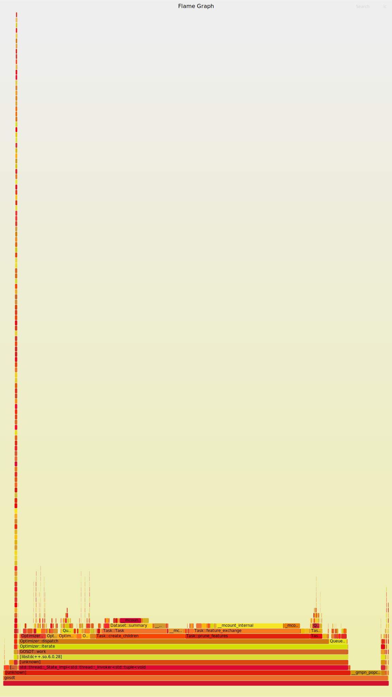
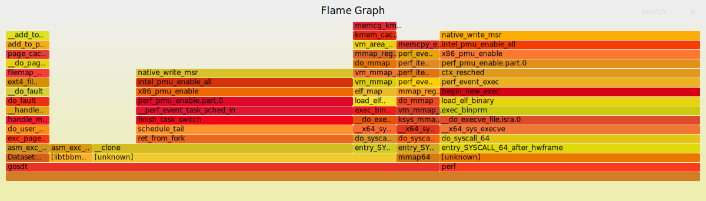
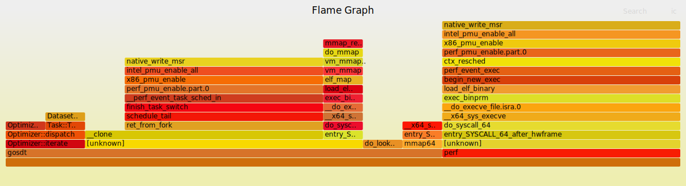

# What is Profiling and why bother learn about them?

Every developer needs to understand what our programs are doing and where 
they are spending precious CPU cycles. This is where **profilers** comes into play. They are tools that record the execution of our program and tell us which functions are executing and how much time they take.

Profilers are excellent tools for collecting data about our program execution. 
When we run our program using a sampling profiler, the program will run as normal but at the same time the profiler is interrupting it several times a second, and every time it does that it takes a sample of stack backtrace. When the program finishes execution, the profiler takes this raw data and makes a summary by observing the frequency of the calls. It tells us which functions are executing and how much time did they take.
Profiling is useful for figuring out which parts of our program are the slowest.
As an example, imagine a program that has functions `A()`, `B()` and `C()`. Function `A()` does something then calls function B(). Function B() does something then calls function C(). Let's say our program is running for some time and profiler took 10 samples. In the first three sample call stack had `A()` and `B()`, next 5 samples we had `A()->B()->C()` and last two samples had `A()->B()`. With this information we know the function `C()` was doing most of the work since it appeared to be the last function in the call stack for 5 samples.
In this project, we use a linux-based profiling tool [perf](https://perf.wiki.kernel.org/index.php/Main_Page) combine with [FlameGraphs](http://www.brendangregg.com/flamegraphs.html) for visualization.

A closely related concept is Benchmarking, which is more about comparing performance. For example, one might use a profiling tool to figure out if a certain function takes a lot of time, then we change the function in a way we think will be faster, then we benchmark the old and new version and see how it differs in term of speed.

In our experiment, we run the experiments for datasets `syn3.txt`, `syn5.txt` and `m2.csv`. First we use `perf` to record the profiling information for our program.

```sh
sudo perf record -g -o m2.data gosdt m2.csv experiments/configurations/debug.json
sudo perf script -i m2.data | /home/leanne/FlameGraph/stackcollapse-perf.pl | /home/leanne/FlameGraph/flamegraph.pl >m2.svg
```



```sh
sudo perf record -g -o syn3.data gosdt syn3.txt experiments/configurations/debug.json
sudo perf script -i syn3.data | /home/leanne/FlameGraph/stackcollapse-perf.pl | /home/leanne/FlameGraph/flamegraph.pl >syn3.svg
```
In flame graph, the highest-level stack frames are at the bottom. The tall spike means that the call-stack is very deep, that is, a lot of nested function calls. Having a wide function (relative to its sibling) means that it takes up most of the time of the parent function. At the very top, we typically have `main` which is more or less in all samples. And is always at the top of the callstack.
Put in a statistical sense, the `x-axis` is for the time series, while the `y`-axis is the depth of the stack-trace, so width seems to be a measure for time.


```sh
sudo perf record -g -o syn5.data gosdt m2.csv experiments/configurations/debug.json
sudo perf script -i syn5.data | /home/leanne/FlameGraph/stackcollapse-perf.pl | /home/leanne/FlameGraph/flamegraph.pl >syn5.svg
```



# Performance measurement 

First, it worth mentioning we have fixed numerous memory leaks in the original GOSDT codes. Hence we now have a more efficient CPU memory usage. All Our experiments Base on Monk2 dataset based on our leaked free version.

## How to read time from perf?

The kind of time we are interested depend on what we want to optimize. In `perf`,
* The `user` time is the time actually spent running your program, which is the relevant number
if we are trying to make your code faster.

* The `sys` time is time spent on things like reading/write files, which is the relevant number if we are trying to optimize your file access.

* The `real` time is most important, if we are just trying to get an overall idea of how long it takes to run your program.

## Comparison against data structures

* Binary decision tree configuration

```
time ./gosdt m2.csv experiments/configurations/debug.json
```

```
real	0m0.909s
user	0m0.862s
sys	0m0.048s
```
* n-ary decision tree configuration

```
real	0m0.929s
user	0m0.905s
sys	0m0.025s
```

# Memory Leaks clean-up

A leak occurs when the last pointer to allocated memory is destroyed or re-assigned without the memory being deallocated.
In the original gosdt codes, there are leaks even with the lightest dataset, and get worse with more complex datasets.

So tracking down a memory leak is a mtter of tracing the pointers' ownership. We don't concern too much on [non-owning pointers](https://godbolt.org/z/Pc5eMT1f3)
As we see in the godbolt example, the rule is generally inferred. In contrast, when we work with smart pointers, the ownership is specified by type. See more info on 
[ownership semantic](https://www.modernescpp.com/index.php/no-new-new).

According to our ASAN report, the source of leak came from 
```cpp
bool Queue::push(Message const & message) {
    message_type * internal_message = new message_type();
    * internal_message = message;
```
in `src/queue.cpp`. 
We know in general that as long as there is a pointer to the memory then it isn't a leak. However, the queue destructor in the original GOSDT isn't freeing anything, i.e.

```cpp
Queue::~Queue(void) {
    return;
}
```
To investigate this leak further, we add print statement in `bool Queue::push(Message const & message)` 
for messages that were added to the queue and removed from the queue to see how some are missed out. We see that there 
are lots of messages are created and destroyed, it might be hard to sort through to to figure out which messages are being leaked.
So, we put a more delibrate check in the queue destructor 
```cpp
Queue::~Queue(void) {
    if (queue.size() != 0) {
      std::cerr << "In Queue destructor, queue size =" << queue.size() << "\n";
      abort();
    }
    return;
}
```
Base on our experiment on a dataset that expects to output a 5-ary tree. We see the above print statements prints 3 times while it meant to be printed 5 times.
So it is liekly some of those queue still contain pointers at the time they are destroyed. Another possibility could be there was 
an exception during the time `internal_message` had ownership. But it seems unlikely. A third possibility turns out to be what we have here. In the `queue.hpp`, 
the `Queue` type was assigned while `queue` contained pointers to messages. This would cause the pointers already in `queue` to be lost. So we make sure this doesn't happen by adding
```cpp
    void operator=(const Queue &) = delete;
    Queue &operator=(Queue &&arg)
    {
      if (arg.queue.size() != 0) {
        std::cerr << "In Queue::operator=, arg.queue is not empty\n";
        abort();
      }
      if (queue.size() != 0) {
        std::cerr << "In Queue::operator=, queue is not empty\n";
        abort();
      }
      return *this;
    }
```
under the public section. As we rebuilt we got compiled error 
```
/home/leanne/Dev/mgosdt/src/state.cpp: In static member function 'static void State::initialize(std::istream&, unsigned int)':
/home/leanne/Dev/mgosdt/src/state.cpp:12:26: error: use of deleted function 'void Queue::operator=(const Queue&)'
   12 |     State::queue = Queue();
```

This might be a leak due to the fact the `State::queue` isn't empty. So we defined our own assignment operator for Queue (above) in checking
if the queue is empty or not. Then we rebuilt and we see the program actually crashed at run time

```
In Queue::operator=, queue is not empty
Aborted (core dumped)
```
This explains why we got a leak. In order to make sure the queue is not empty, we need to make sure all the messages in the queue are removed and deleted.
The correct strategy is to remove and delete the messages from the queue in the assignment operator. Because, if we don't, then the messages that are on the queue wil be leaked since
nothing will be pointing to them. A [simplified version](https://godbolt.org/z/MscvWccGh) or with [debug output](https://godbolt.org/z/d45xsdPWb).
The leak occurs in the line 16 `a=a2`. A leak occurs when nothing is pointing to the int we allocated on line 13, and this caused a leak. Because nothing is pointing to the `int`
we allocated on line 13, there is no way it can ever be deallocated. What we generally need to deallocate is to make sure that we deallocate the object before that
[leak-free example](https://godbolt.org/z/Y7bW4GGnq). Now come back to our situation, we lost the string here 
```
   21 |     State::queue = Queue();
```

The `State::queue` was not empty. It had strings pointers to messages. But then we assigned a new empty Queue to `State::queue`, so those pointers are now gone. And the messages floated away.
To rectify this situation, we added a static void function `clearQueue` in the `state.hpp` to make sure all message pointers are deleted before assignments. To figure out where to call the garbage collection kind of helper function, we run with gdb
```
gdb --args ./gosdt syn5.txt config.json
```
and we see
```
bt
#0  __GI_raise (sig=sig@entry=6) at ../sysdeps/unix/sysv/linux/raise.c:50
#1  0x00007ffff6f27859 in __GI_abort () at abort.c:79
#2  0x00005555556c7ed6 in Queue::operator= (arg=..., this=0x555555755a20 <State::queue>) at /home/leanne/Dev/mgosdt/src/queue.hpp:79
#3  State::reset () at /home/leanne/Dev/mgosdt/src/state.cpp:24
#4  0x0000555555687b15 in Optimizer::~Optimizer (this=0x7fffffffc470, __in_chrg=<optimized out>) at /home/leanne/Dev/mgosdt/src/optimizer.cpp:15
#5  0x00005555555f37c7 in GOSDT::fit (this=<optimized out>, data_source=..., models=...) at /usr/include/c++/9/ext/new_allocator.h:89
#6  0x00005555555f88ae in GOSDT::fit (this=0x7fffffffd350, data_source=..., result=...) at /home/leanne/Dev/mgosdt/src/gosdt.cpp:21
#7  0x000055555558960c in main (argc=<optimized out>, argv=<optimized out>) at /home/leanne/Dev/mgosdt/src/main.cpp:40
```

From gdb, we know that `Queue::operator=` is called. And line24 `state.cpp` is `State::queue = Queue()`; So the `clearQueue(State::queue)` should be placed just before that, i.e.
```cpp
class State {
public:

    // Global state to which all thread shares access 
    static Dataset dataset;
    static Graph graph; 
    static Queue queue;
    static int status;

    // Local state to which each thread has exclusive access to a single entry
    static std::vector< LocalState > locals;
    static void clearQueue(Queue &queue);
    static void initialize(std::istream & data_source, unsigned int workers = 1);
    static void reset(void);
};
```
in `state.hpp` and 
```cpp
void State::clearQueue(Queue &queue) {
    while(queue.size()!=0){
      Message m;
      queue.pop(m);
    }
}
```
in `state.cpp`. Finally we rebuilt and we see that the leaks detected from ASAN gone completely.


