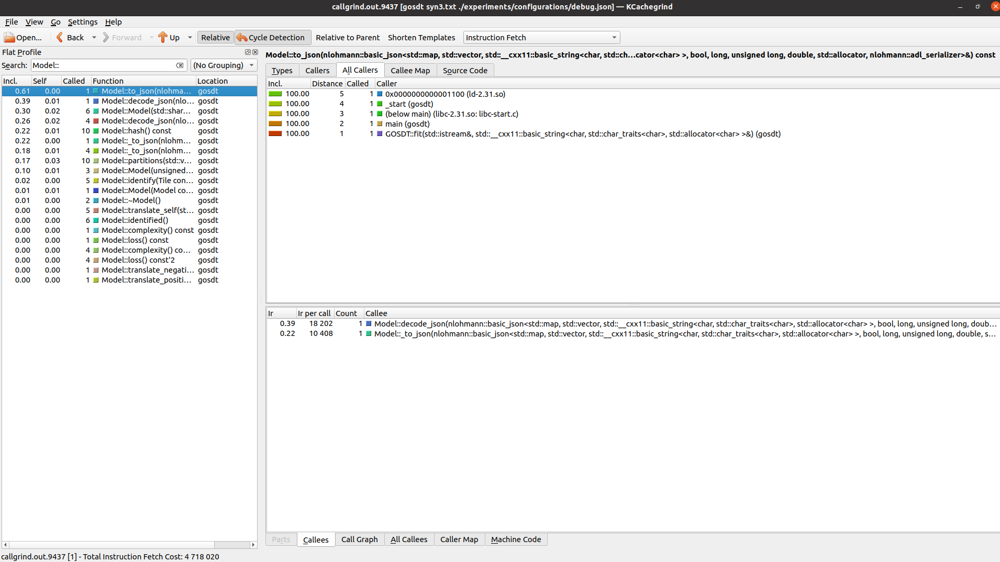
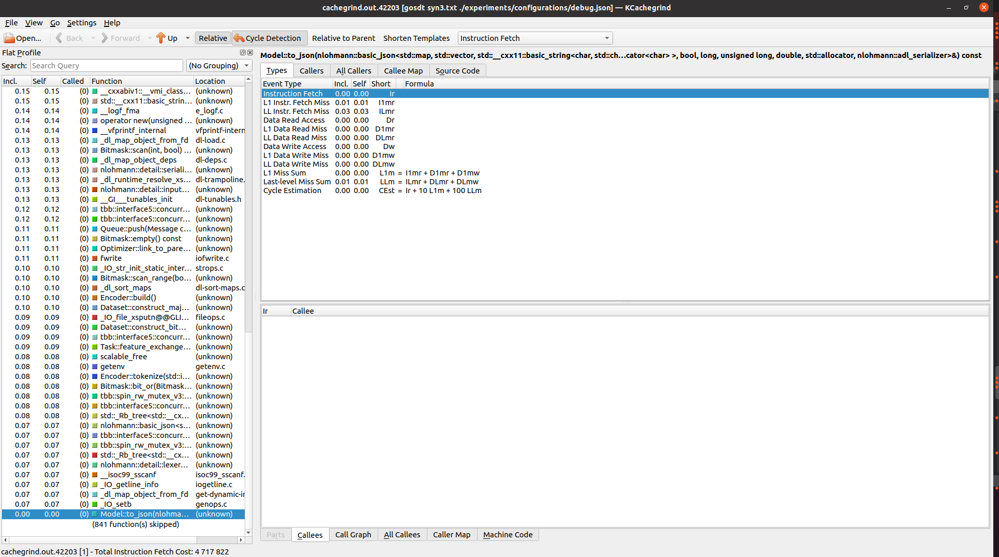
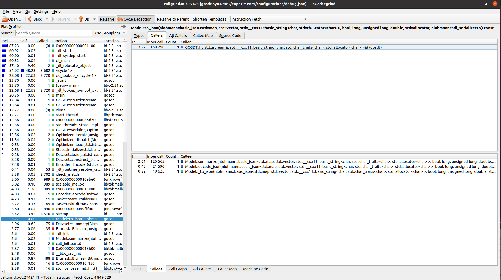
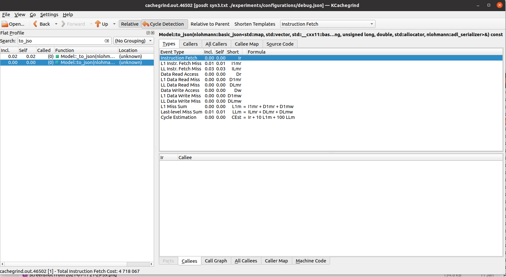

- http://valgrind.org/docs/manual/cg-manual.html

### How to read time from perf?

The kind of time we are interested depend on what we want to optimize. In `perf`,
* The `user` time is the time actually spent running your program, which is the relevant number
if we are trying to make your code faster.

* The `sys` time is time spent on things like reading/write files, which is the relevant number if we are trying to optimize your file access.

* The `real` time is most important, if we are just trying to get an overall idea of how long it takes to run your program.

### GOSDT


#### Timing

Base on Monk2 dataset (`experiments/datasets/monk_2/data.csv`),

```sh
leanne@tensorbook:~/Dev/GeneralizedOptimalSparseDecisionTrees$ time gosdt experiments/datasets/monk_2/data.csv experiments/configurations/debug.json >outputs/m2.json
real0m2.962s
user0m9.241s
sys0m1.964s
```

#### Profiling with Callgrind 

```sh
==9437== Callgrind, a call-graph generating cache profiler
==9437== Copyright (C) 2002-2017, and GNU GPL'd, by Josef Weidendorfer et al.
==9437== Using Valgrind-3.15.0 and LibVEX; rerun with -h for copyright info
==9437== Command: gosdt syn3.txt ./experiments/configurations/debug.json
==9437==
==9437== For interactive control, run 'callgrind_control -h'.
==9437==
==9437== Events    : Ir
==9437== Collected : 4718020
==9437==
==9437== I   refs:      4,718,020
```

To get a more accurate view, we run `kcachegrind callgrind.out.9437` and we see a GUI,  

The screenshot above shows the profiling results for my code. The left panel shows the functions called by my code sorted by total time spent inside each function. Because functions call each other, callgrind shows two cost metrics as proxies for time spent in each function: Incl., showing the total cost of a function, and self, showing the time spent in each function itself discounting the callees. By clicking on "Self" to order to functions by the cost of the function itself, we sort the functions by the costs of their own codes.

#### Cache misses count with Cachegrind 

To inspect cache misses, we run `valgrind --tool=cachegrind gosdt syn3.txt ./experiments/configurations/debug.json >outputs/syn3.json`

```sh
==42203== Cachegrind, a cache and branch-prediction profiler
==42203== Copyright (C) 2002-2017, and GNU GPL'd, by Nicholas Nethercote et al.
==42203== Using Valgrind-3.15.0 and LibVEX; rerun with -h for copyright info
==42203== Command: gosdt syn3.txt ./experiments/configurations/debug.json
==42203== 
--42203-- warning: L3 cache found, using its data for the LL simulation.
==42203== 
==42203== I   refs:      4,717,822
==42203== I1  misses:       14,052
==42203== LLi misses:        5,793
==42203== I1  miss rate:      0.30%
==42203== LLi miss rate:      0.12%
==42203== 
==42203== D   refs:      1,765,218  (1,193,885 rd   + 571,333 wr)
==42203== D1  misses:       32,573  (   26,042 rd   +   6,531 wr)
==42203== LLd misses:       15,612  (   10,773 rd   +   4,839 wr)
==42203== D1  miss rate:       1.8% (      2.2%     +     1.1%  )
==42203== LLd miss rate:       0.9% (      0.9%     +     0.8%  )
==42203== 
==42203== LL refs:          46,625  (   40,094 rd   +   6,531 wr)
==42203== LL misses:        21,405  (   16,566 rd   +   4,839 wr)
==42203== LL miss rate:        0.3% (      0.3%     +     0.8%  )

```

Then, `kcachegrind cachegrind.out.42203` invokes 

* The I1 miss rates states there were 14,052 instruction cache misses.

* The D1 miss rates states there was a lot of cache L1 misses.

* The LL miss rates states there was small amount of last level cache misses.

### MGOSDT

#### Timing

Base on Monk2 dataset (`experiments/datasets/monk_2/data.csv`),

```sh
leanne@tensorbook:~/Dev/mgosdt$ time gosdt experiments/datasets/monk_2/data.csv experiments/configurations/debug.json >outputs/m2.json
real0m0.465s
user0m0.453s
sys0m0.012s
```

And the training duration can be seen in the `outputs/m2.json` as 0.432, compared to GOSDT's training duration as 2.747, which is 6.41 faster.

So, in `real time`, MGOSDT 18 times faster!

#### Profiling with Callgrind

```sh
==27421== Callgrind, a call-graph generating cache profiler
==27421== Copyright (C) 2002-2017, and GNU GPL'd, by Josef Weidendorfer et al.
==27421== Using Valgrind-3.15.0 and LibVEX; rerun with -h for copyright info
==27421== Command: gosdt syn3.txt ./experiments/configurations/debug.json
==27421== 
==27421== For interactive control, run 'callgrind_control -h'.
==27421== 
==27421== Events    : Ir
==27421== Collected : 4849529
==27421== 
==27421== I   refs:      4,849,529
```
Then run `cg_annotate cachegrind.out.* --auto=yes` we see 
```sh
I1 cache:         32768 B, 64 B, 8-way associative
D1 cache:         32768 B, 64 B, 8-way associative
LL cache:         6291456 B, 64 B, 12-way associative
Command:          gosdt syn3.txt ./experiments/configurations/debug.json
Data file:        cachegrind.out.42203
Events recorded:  Ir I1mr ILmr Dr D1mr DLmr Dw D1mw DLmw
Events shown:     Ir I1mr ILmr Dr D1mr DLmr Dw D1mw DLmw
Event sort order: Ir I1mr ILmr Dr D1mr DLmr Dw D1mw DLmw
Thresholds:       0.1 100 100 100 100 100 100 100 100
```

Run `kcachegrind callgrind.out.27421` we invoke 

#### Cache misses count with Cachegrind 

To inspect cache misses, we run `valgrind --tool=cachegrind gosdt syn3.txt ./experiments/configurations/debug.json >outputs/syn3.json`

```sh
==109661== Cachegrind, a cache and branch-prediction profiler
==109661== Copyright (C) 2002-2017, and GNU GPL'd, by Nicholas Nethercote et al.
==109661== Using Valgrind-3.15.0 and LibVEX; rerun with -h for copyright info
==109661== Command: gosdt syn3.txt ./experiments/configurations/debug.json
==109661==
--109661-- warning: L3 cache found, using its data for the LL simulation.
==109661==
==109661== I   refs:      4,849,393
==109661== I1  misses:       14,184
==109661== LLi misses:        5,924
==109661== I1  miss rate:      0.29%
==109661== LLi miss rate:      0.12%
==109661==
==109661== D   refs:      1,817,630  (1,227,278 rd   + 590,352 wr)
==109661== D1  misses:       32,703  (   26,114 rd   +   6,589 wr)
==109661== LLd misses:       15,665  (   10,779 rd   +   4,886 wr)
==109661== D1  miss rate:       1.8% (      2.1%     +     1.1%  )
==109661== LLd miss rate:       0.9% (      0.9%     +     0.8%  )
==109661==
==109661== LL refs:          46,887  (   40,298 rd   +   6,589 wr)
==109661== LL misses:        21,589  (   16,703 rd   +   4,886 wr)
==109661== LL miss rate:        0.3% (      0.3%     +     0.8%  )
```

Run `kcachegrind cachegrind.out.46502`, we invoke 

##### Instruction misses
- **Ir**: number of instructions executed
- **I1mr**: I1 cache read misses
- **ILmr**: LL (last level) cache instruction read misses

##### Cache misses
- **Dr**: number of memory reads
- **D1mr**: D1 cache read misses
- **DLmr**: LL (last level) cache data read misses
- **Dw**: number of memory writes
- **D1mw**: D1 cache write misses
- **DLmw**: LL (last level) cache data write misses

>On a modern machine, an L1 miss will typically cost around 10 cycles, an LL miss can cost as much as 200 cycles, and a mispredicted branch costs in the region of 10 to 30 cycles. Detailed cache and branch profiling can be very useful for understanding how our program interacts with the machine and thus how to make it faster.


